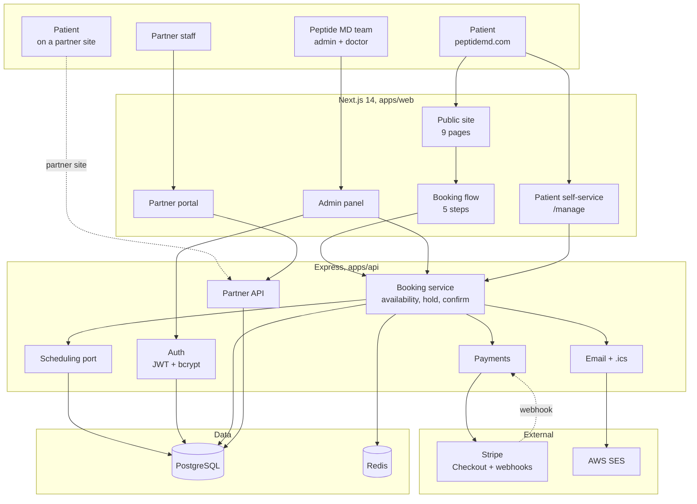
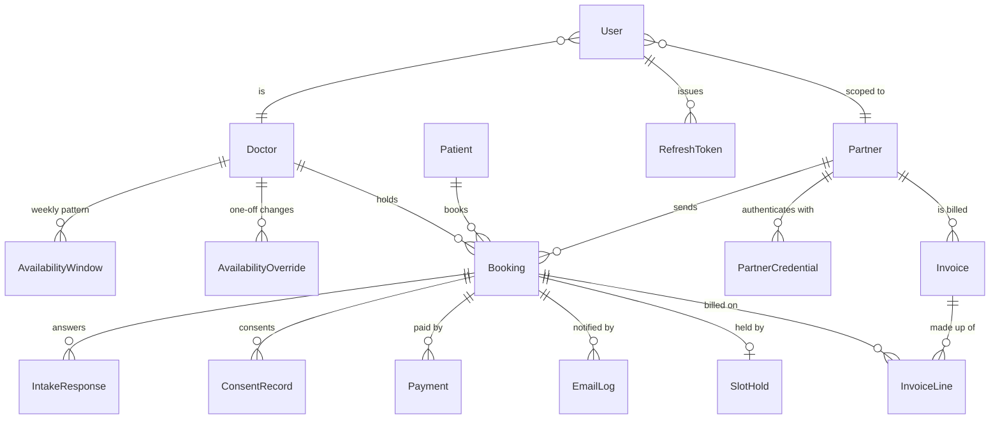
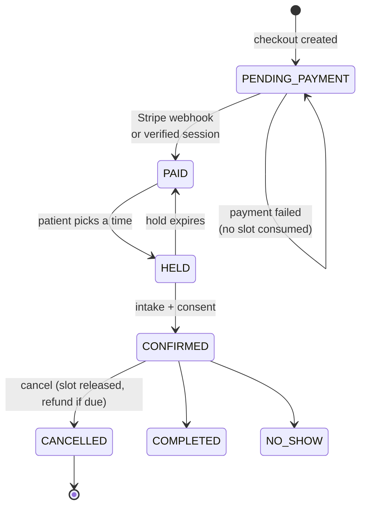
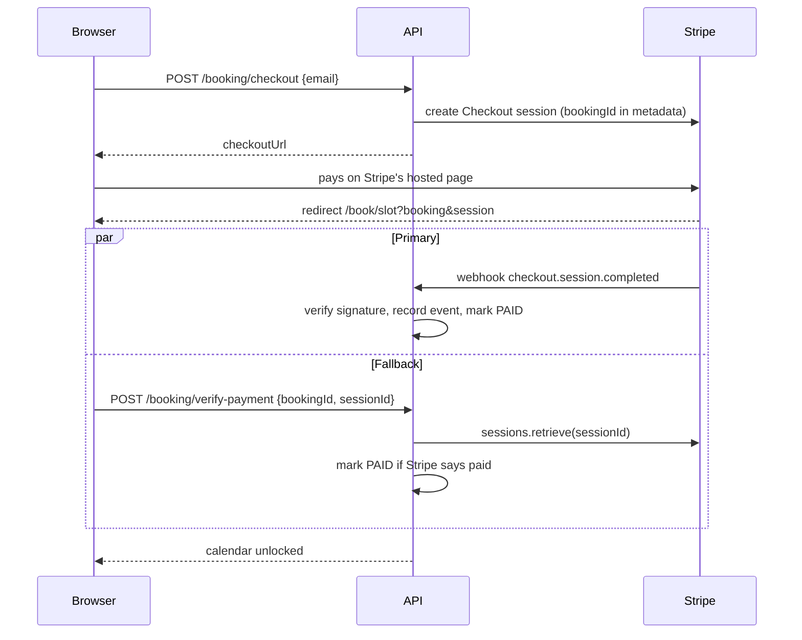

# Peptide MD. System Architecture

Milestone 1 deliverable 1: the database design, the service breakdown, and the
scheduling and Stripe integration design.

> **Deviation from the scope, agreed 10 August 2026.** The scope names Cal.com
> as the scheduling core. Scheduling is instead in-house, behind the same
> provider interface the scope promised. Every behaviour the scope commits to
> is delivered and tested; the reasoning is in section 5.

---

## 1. Services

**Why the API is separate from Next.js.** The partner API is a public product, other companies build against it, it is versioned, and it is rate limited per
partner. That is a different lifecycle from the website, so it is a different
deployable. It also keeps the scheduling and payment logic in one place rather
than split between route handlers and server actions.

---

## 2. Data model

Eighteen tables. The ones carrying a design decision rather than just data:

| Table | Why it exists in this shape |
|---|---|
| `slot_holds` | Unique on `(doctorId, startsAt)`. **This constraint is the shared-calendar guarantee**, when two channels reach for one time, the database lets exactly one insert through. |
| `webhook_events` | Unique on `(source, externalId)`. Stripe retries; this makes handling idempotent and keeps the payload so a failed handler is replayable rather than a lost booking. |
| `intake_responses` | Rows, not a JSON blob, so the question set can change without rewriting historic answers. |
| `consent_records` | Stores the **exact wording agreed to**, so consent stays provable after the wording changes. |
| `invoice_lines` | Unique on `(invoiceId, bookingId)`, a booking is billed once and only once. The rate is copied onto the line, so a later rate change never restates history. |
| `payments` | Append-only event log per booking, not a status column. The sequence is the audit trail. |
| `email_logs` | Answers "did the patient get their confirmation?" without guessing, and stops a reminder double-sending. |

Money is `Int` minor units everywhere. Times are `timestamptz` in UTC with the
patient's IANA zone stored beside them, so their time can be rendered back
correctly without re-deriving it.

---

## 3. The booking state machine

**Payment precedes the calendar.** A booking exists before payment but holds
nothing. Only a `PAID` booking may hold a slot, enforced in the API, the
`/hold` endpoint returns `PAYMENT_REQUIRED` otherwise. So an abandoned or
declined checkout can never leave a time in limbo.

---

## 4. Stripe integration

Two paths, deliberately. The **webhook is authoritative**, it arrives whether
or not the patient comes back. The **return path** exists because the patient
usually beats the webhook, and staring at a spinner after paying is where
people abandon. It is not trusting the browser: the browser supplies a session
id and the server asks Stripe what that session's status actually is.

Both are idempotent. Card data never touches Peptide MD. Stripe Checkout is
hosted, so the PCI surface is Stripe's.

---

## 5. Scheduling, in-house

Everything scheduling goes through one interface, `SchedulingProvider`
(`apps/api/src/scheduling/provider.ts`): `getAvailability`, `hold`, `confirm`,
`release`, `cancel`, `reschedule`.

| Adapter | Status |
|---|---|
| `internal` | **In use.** Postgres-backed. Weekly pattern, date overrides, slot holds, the shared-calendar guarantee. |
| `calcom` | Written against the Cal.com Platform v2 API, never exercised. Retained as an exit. |

Selected by `SCHEDULING_PROVIDER`.

### Why not Cal.com

The scope recommended Cal.com Platform to remove the highest-risk engineering.
That reasoning held before anything was built. Once the internal provider
existed and was tested, the calculus changed:

- **Cost.** Platform Starter is $299/month including 25 bookings, then $0.99
  each. At the ~130 consultations a month in Ross's own worked example that is
  roughly **$400/month**. The scope's "entry tier covers 500 bookings" appears
  to conflate Starter with Essentials.
- **The free tier does not solve the problem.** Cal.com Free is a public
  booking page. Anyone with the link books without paying, and Peptide MD
  takes payment *before* the calendar. Cal.com's own payment app is a paid
  feature and inverts that order.
- **Licensing.** Self-hosting is AGPL; white-labelling into partner sites, the entire Milestone 2 model, is what the free licence does not cover. The
  scope flagged this itself.

What Cal.com would still have added is two-way sync with the doctor's personal
calendar. That was dropped deliberately: there is no confirmation which
provider he uses (Outlook and NHS Mail are as likely as Google in UK practice),
OAuth consent and token expiry are ongoing friction, and pulling his entire
personal calendar into a medical platform is a privacy cost.

**The accepted trade-off:** the doctor must mark his own busy time. Mitigated
by the diary below, and by the fact that every confirmed booking already sends
him an `.ics` invite, so Peptide MD appointments appear in whatever calendar
he uses.

### The doctor's diary

`/admin/availability` carries two things:

1. **The week**, every slot his pattern produces, labelled booked / free /
   blocked / held. One tap blocks a free slot; one tap frees it again.
2. **The standing pattern**, weekly windows plus dated overrides, set once.

Both read the same grid (`buildSlotGrid`), so the diary and the patient-facing
calendar cannot disagree about where the slots are.

Two rules enforced in the API, not the UI:

- **A booked slot cannot be blocked**, `409 SLOT_BOOKED`. The patient is
  already coming; cancel the appointment so they are told.
- **A doctor can only reach his own diary**, `403` otherwise.

Blocking invalidates the availability cache, so the change applies to the
website and every partner site at the same moment.

## 6. Access control

Three independent enforcement points. A hidden nav item is never the only thing
between a role and a screen.

| Layer | Enforces |
|---|---|
| Next.js middleware | Token present → redirect to the right login. Cannot verify signatures (edge runtime). |
| API | Verifies the JWT on every request; `requireRole`, `requirePartner`. **The real boundary.** |
| Server component | `requireSession` / `requirePermission` for an explanatory screen instead of a bare 403. |

The partner tenant boundary is absolute: `partnerIdOf(req)` reads the id from
the **verified token**, never from a parameter or body. No partner endpoint can
express a question about another partner's data.

| Role | Reach |
|---|---|
| Admin | Everything |
| Doctor | Own diary, own availability, own public profile. No money, rates, partners or invoices, stripped server-side, not hidden in CSS. |
| Partner | Own bookings, totals, invoices, credentials. Never clinical content. |
| Patient | No account. `/manage` proves inbox control with a six-digit code. |

---

## 7. Caching and resilience

Redis carries availability caching (60s), slot-hold fast path, and rate
limiting. It is **not** the source of truth. Postgres is. If Redis is
unavailable the platform still books correctly, with more database work.

Login rate limiting counts **failed attempts only**, keyed per email + IP, so a
clinic behind one NAT address cannot lock itself out by signing in normally
while credential spraying is still throttled.

---

## 8. Verification

| Suite | Covers |
|---|---|
| `node scripts/e2e.mjs` | 60, real Stripe Checkout, all four roles, validation, failure paths, six widths, WCAG 2.2 tap targets |
| `node scripts/verify-api.mjs` | 20. API contracts, concurrency, webhook signature rejection |
| `node scripts/verify-scheduling.mjs` | 9, provider contract; run against any adapter to compare |
| `node scripts/verify-timezones.mjs` | 5, both UK clock changes, Sydney across both hemispheres' transitions |
| `node scripts/verify-no-free-bookings.mjs` | 7, adversarial: every route to a consultation without paying |
| `node scripts/verify-diary.mjs` | 8, diary rendering, one-tap block, booked-slot protection, cross-doctor access |

Run `pnpm build` only when the web server is stopped, rebuilding under a
running `next start` rewrites chunk hashes and every page dies with a
ChunkLoadError. `scripts/e2e.mjs` detects this and fails fast with that message.

## 9. Deployment

| Component | Target |
|---|---|
| `apps/web` | Vercel |
| `apps/api` | AWS EC2 / ECS |
| Database | AWS RDS PostgreSQL |
| Cache | AWS ElastiCache Redis |
| Email | AWS SES |
| Files | AWS S3 (invoice PDFs) |
| Monitoring | Sentry + CloudWatch |

`assertProductionReadiness` refuses to boot in production with a placeholder
webhook secret, a development JWT secret, or a provider named without its
credentials. In development the same checks log warnings so the platform still
runs before those accounts exist.
